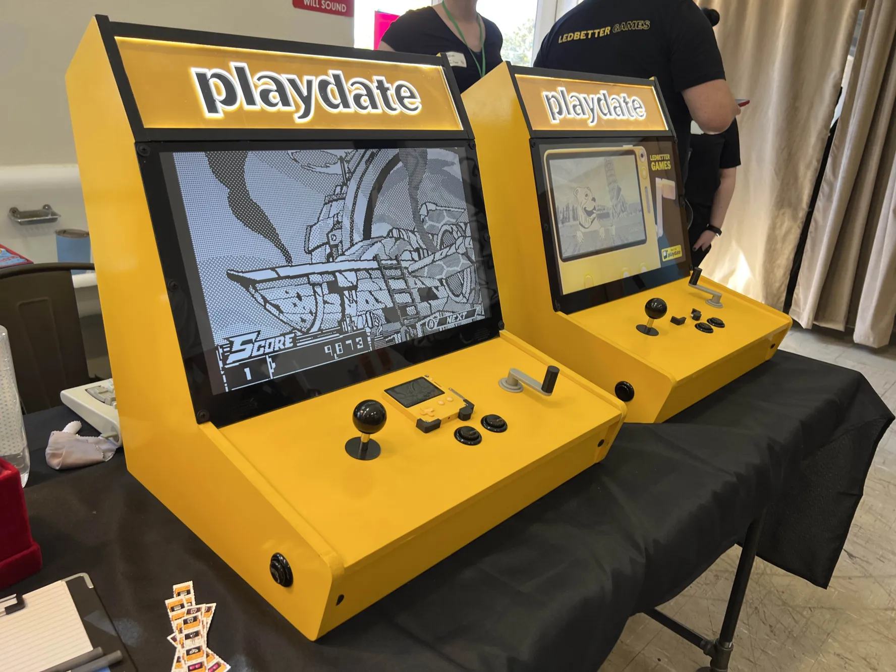

# Playdate Cabinet
CAD and code for the Playdate Cabinet

	mirrorjr/ - Mirror port for the Raspberry Pi
	crank/ - KiCad files for crank sensor PCB, Arduino sketch for Seeeduino Xiao controller
	cabinet.skp - SketchUp CAD file for cabinet

BOM

	Display: Scepter ‎E205W-16003R 20" 1600x900 75Hz Ultra Thin LED Monitor
	Raspberry Pi 3 B+
	EG STARTS JXGF-5Pin-Stick Arcade Joystick
	3x Reyann Black Happ Type Standard Arcade Push Button with Microswitch

Paint: Rustoleum Painter's Touch 2x Golden Sunset

_Playdate Cabinet is a side project, not a Panic product! Please email dave@panic.com with questions, not Playdate support!_

