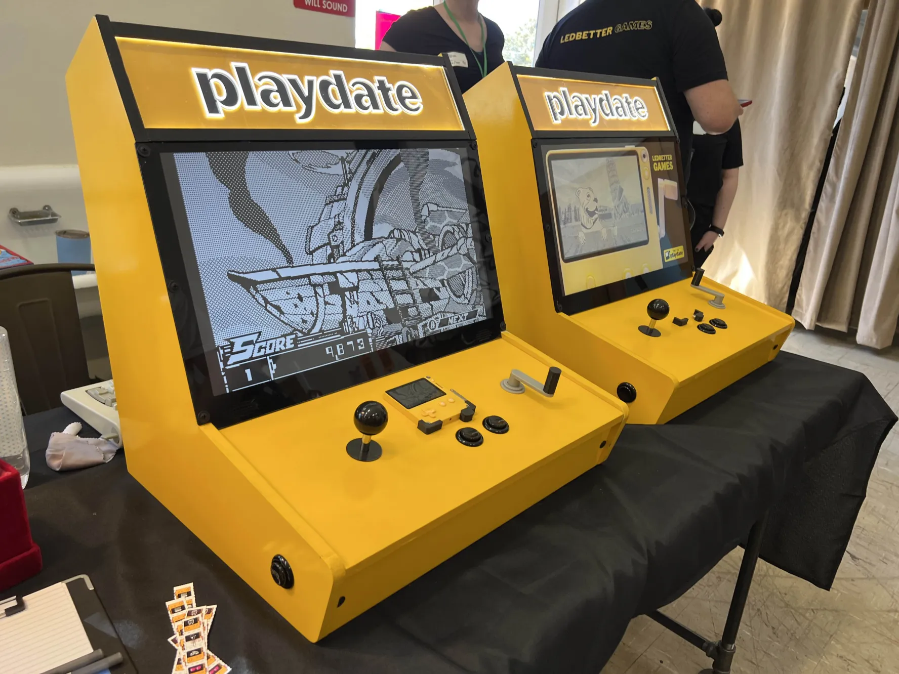

# Playdate Cabinet
CAD and code for the Playdate Cabinet

	mirrorpi/ - Mirror port for the Raspberry Pi
	crank/ - KiCad files for crank sensor PCB, Arduino sketch for Seeeduino Xiao controller
	cabinet.skp - SketchUp CAD file for cabinet

Build the cabinet version with `make -C mirrorpi rpi`, or the physical-Playdate-controller version with `make -C mirrorpi rpi-no-controls`. The latter accepts `--viewport=x,y,width,height` for an optional destination rectangle, for example:

	./mirrorpi/mirror-no-controls --viewport=40,48,640,384

BOM

	Display: Scepter ‎E205W-16003R 20" 1600x900 75Hz Ultra Thin LED Monitor
	Raspberry Pi 3 B+
	EG STARTS JXGF-5Pin-Stick Arcade Joystick
	3x Reyann Black Happ Type Standard Arcade Push Button with Microswitch

Paint: Rustoleum Painter's Touch 2x Golden Sunset

raspi-config: enable serial, but not login over serial

add `dwc_otg.speed=1 video=HDMI-A-1:1280x720M@60` to cmdline.txt

add

	hdmi_group=1
	hdmi_drive=2

to [all] in config.txt, create /etc/asound.conf:

	defaults.pcm.card 1
	defaults.ctl.card 1

do crontab -e, add

	@reboot /home/pi/runmirror.sh

_Playdate Cabinet is a side project, not a Panic product! Please email dave@panic.com with questions, not Playdate support!_

